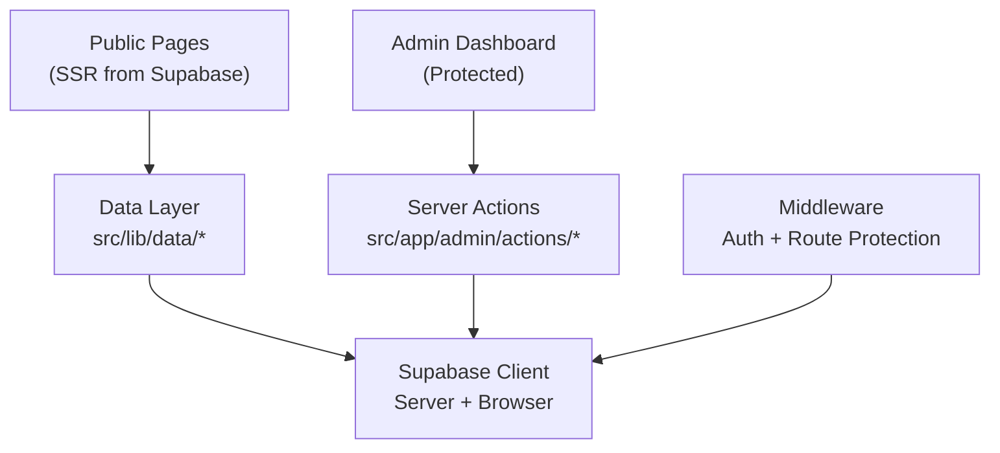

# Portfolio Project — Full Build Walkthrough

## What Was Built

A **production-grade portfolio website** for Jyotirmoy Bhowmik using **Next.js 16 (App Router)**, **TypeScript**, **Tailwind CSS v4**, and **Supabase**.

---

## Architecture Summary



---

## Pages Created (15 Routes)

| Route | Type | Description |
|---|---|---|
| `/` | Dynamic | Hero, featured projects, skills, certifications, CTA |
| `/about` | Dynamic | Biography, skills deep-dive, achievements |
| `/projects` | Dynamic | Filterable grid with search, domain/tech filters |
| `/projects/[slug]` | Dynamic | Project detail with metadata, links, tech stack |
| `/contact` | Dynamic | Contact info, social links, message form |
| `/admin/login` | Static | Email/password auth via Supabase |
| `/admin` | Dynamic | Dashboard with stats cards, audit log feed |
| `/admin/projects` | Dynamic | Projects table with CRUD |
| `/admin/projects/new` | Static | New project form |
| `/admin/projects/[id]/edit` | Dynamic | Edit project form |
| `/admin/skills` | Dynamic | Skills manager with inline edit |
| `/admin/certifications` | Dynamic | Certifications manager |
| `/admin/achievements` | Dynamic | Achievements manager |
| `/admin/analytics` | Dynamic | Page views bar chart + data table |

---

## Design System

- **Theme**: Midnight + Indigo dark theme with glassmorphism
- **Fonts**: Inter (body) + JetBrains Mono (code)
- **Key utilities**: `.glass`, `.gradient-text`, `.gradient-bg`, `.hover-lift`, `.dot-pattern`, `.proficiency-bar`
- **Animations**: fade-in, slide-up, scale-in, float, glow, shimmer, gradient-shift
- **Stagger classes**: `.stagger-1` through `.stagger-5`

---

## File Structure

```
src/
├── app/
│   ├── layout.tsx              # Root layout w/ Navbar + Footer + SEO
│   ├── page.tsx                # Home page
│   ├── globals.css             # Design system
│   ├── error.tsx               # Error boundary
│   ├── not-found.tsx           # 404 page
│   ├── loading.tsx             # Loading spinner
│   ├── about/page.tsx
│   ├── contact/page.tsx
│   ├── projects/
│   │   ├── page.tsx            # Listing
│   │   └── [slug]/page.tsx     # Detail
│   └── admin/
│       ├── layout.tsx          # Sidebar layout
│       ├── page.tsx            # Dashboard
│       ├── login/page.tsx
│       ├── actions/            # Server actions
│       │   ├── projects.ts
│       │   ├── skills.ts
│       │   ├── certifications.ts
│       │   └── achievements.ts
│       ├── projects/
│       │   ├── page.tsx
│       │   ├── new/page.tsx
│       │   └── [id]/edit/page.tsx
│       ├── skills/page.tsx
│       ├── certifications/page.tsx
│       ├── achievements/page.tsx
│       └── analytics/page.tsx
├── components/
│   ├── ui/                     # Button, Card, Badge, Skeleton
│   ├── layout/                 # Navbar, Footer
│   ├── projects/               # ProjectsGrid (client)
│   └── admin/                  # ProjectsTable, EditProjectForm,
│                               # SkillsManager, CertificationsManager,
│                               # AchievementsManager
├── lib/
│   ├── supabase/               # client.ts, server.ts, middleware.ts
│   ├── data/                   # projects, skills, certifications,
│   │                           # achievements, content
│   └── database.types.ts       # TypeScript types
└── middleware.ts               # Auth + route protection
```

---

## Build Result

```
✓ Compiled successfully in 9.0s
✓ Finished TypeScript in 10.0s
✓ Collecting page data in 1685.1ms
✓ Generating static pages (15/15) in 1307.3ms
✓ Finalizing page optimization in 186.9ms
Exit code: 0
```

---

## What's Next

1. **Apply SQL migrations** to Supabase (files in `supabase/migrations/`)
2. **Provide the Service Role Key** for admin operations
3. **Seed data** via `004_seed_data.sql`
4. **Wire up the contact form** to an email service or Supabase Edge Function
5. **Add image uploads** via Supabase Storage for project thumbnails
6. **Deploy** to Vercel
